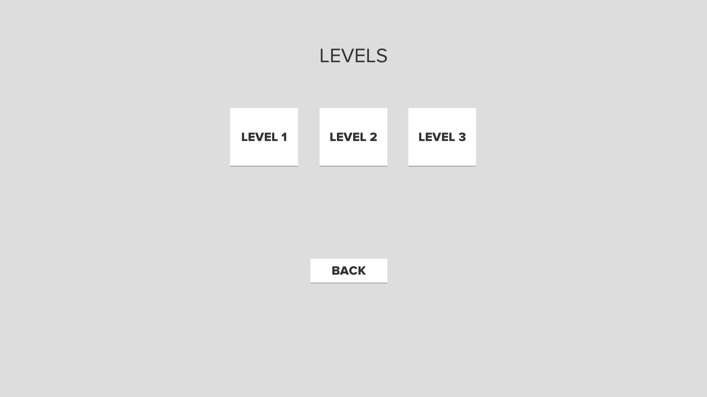
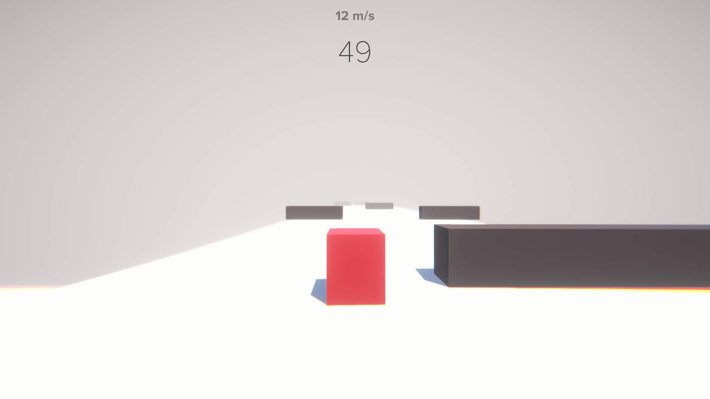
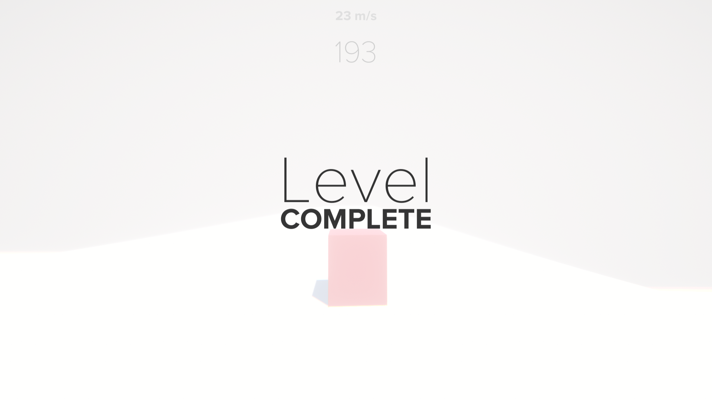
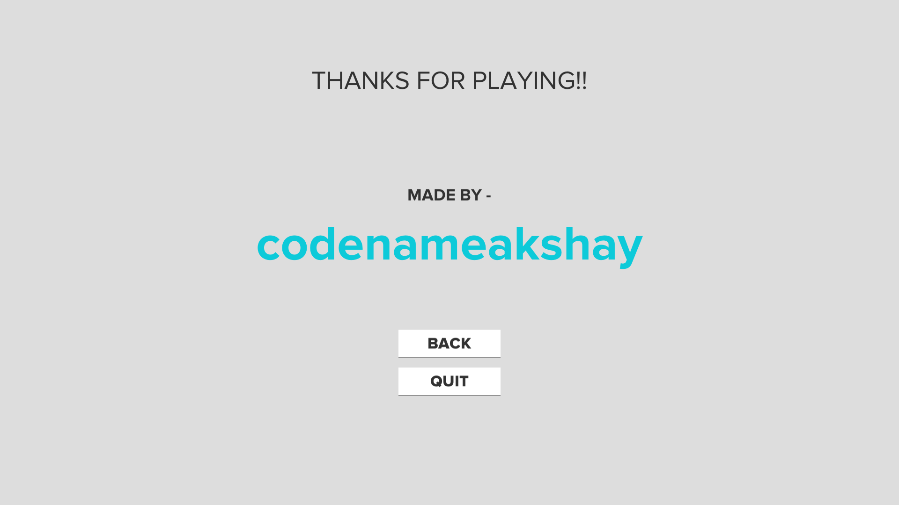
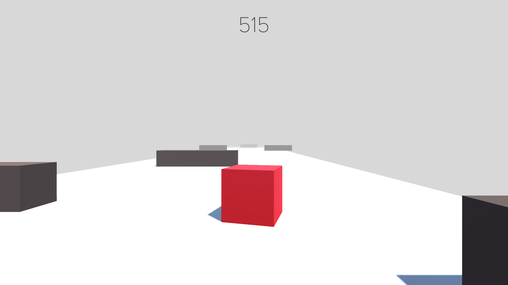

# Cubify

First try at a Unity 3D game. Simple game with 3 levels currently, don't hit obstacles, that's all.

# Controls

Use the <kbd>A</kbd> key to move the player left and the <kbd>D</kbd> to move the player right. That's it.

# Demo

**Screens**

|  |  |  |  |  |
| :-------------: | :-------------:  | :-------------:  | :-------------:  | :-------------:  |
|     Main Menu     |    Levels    |    Game     |     Level Complete       |     Credits     |

**Post Processing**
|  |  |
| :-------------: | :-------------:  |
|     Off     |    On    | 
# Usage

The final build can be found in `Build/` directory, where the `.exe` file is an executable.
You can also clone the repo, and then open the project in Unity and build it to play the game.